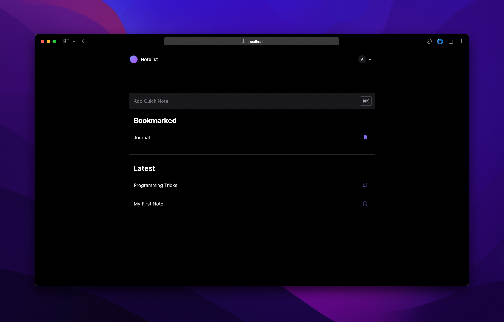
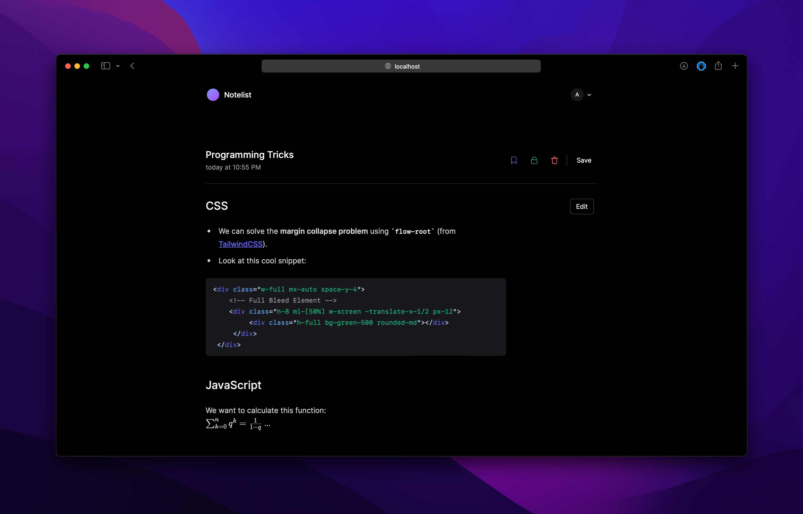

# Notes
Simple note taking app using Next.js and Prisma.

Supporting **Markdown** and **LaTeX**.




## Features
- Markdown Support
- LaTeX Support
- Public Share Link
- ...

## Gettings Started

First, install the dependencies with `npm install`.

Rename `.example.env` to `.env` and put in your email account and server address and your mysql connection string.

For example you can create a free mysql database on [Railway](https://railway.app).

Then, run the development server:

```bash
npm run dev
# or
yarn dev
```

## Prisma
This project is using [Prisma](https://www.prisma.io) as ORM.
To generate the client run:
```bash
npx prisma generate
```
and to migrate you can use
```bash
prisma migrate dev --name "Your message"
```

To run prisma studio: `npx prisma studio`


Open [http://localhost:3000](http://localhost:3000) with your browser to see the result.
